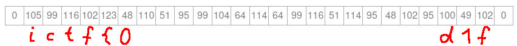

# No Thoughts, Head Empty
# Fewer Thoughts, Head Emptier
Both challenges are quite similar, so I only write a single writeup for them.

## Understanding the basics
In both cases, we have a single brainfuck file. (I recommend to __not__ run it with the interpreter given in the description, but I found an interpreter / visualizer that is safer to use: [BF Visualizer](https://fatiherikli.github.io/brainfuck-visualizer/). Let's put the first program into it and watch it (Check the *Optimize* box and reduce the delay for a deccent speed). The program will eventually crash because of the limited tape, but looking at the values, they look like ASCII values:

So, there is the flag, but it is truncated in the end. We could modify the sourcecode for a wider tape, or we look into the source code (which we'll need for the second challenge anyway.) I structured the code to be more readable: Before and after `[]` is a newline, so loops are in a line by themselfs. The beginning constists of blocks of this form:
```
>>+++++++++++
[<+++++++++++>-]
--
[<-------->+]
```
What is happening here? The first two lines:
```
We increment a cell X = 11 times
We have a small loop that: Goes to the left, increment by Y = 11, go right, decrement by 1. Repeat
```
This is a multiplication `X * Y`: The left cell used as the result starting with 0, the right cell is the loop counter starting with `Y` (set in the first line). For each iteration, the left cell is incremented by `X`, and this is done `Y` times, so `X*Y`.
The lines 3 and 4 are basically the same, but instead of adding it to the left cell, it subtracts. So, this whole block computes:
`cell = X * Y - A * B`, where the 4 variables can be determined by the number of `+` or `-` in the four lines. In our example: `cell = 11 * 11 - 2 * 8 = 105 = ascii('i')`
For the first challenge, I appended to every block `<.>` which prints the value we just built and removed the first few blocks of code for the remaining part of the flag to fit into memory. This solves `No Thoughts, Head Empty`.

But for the second challenge, it is more complicated. The description suggests that we have a similar challenge and looking at the source, we can identify the same 4-line blocks of code, but the numbers are larger. This stops us from running it: It is very slow and the numbers are not ascii values anymore. At this point, I wrote a small function to parse and print the values:
```python
def get_num(ls): # takes 4 lines as strings
	pms = [0] * 4
	for i in range(4): # count the number of plus and minus for each line
		pms[i] = (ls[i].count('+'), ls[i].count('-'))
	# Some lines add, some lines substract.
	# With max(), I get the number, no matter which of the two options is used,
	# because the loop counter always only appears once
	val = max(pms[0]) * max(pms[1]) # this is X*Y
	mul = 1
	if ls[3][2] == '-': # detect if we add or subtract the second part
		mul = -1
	val += mul * max(pms[2]) * max(pms[3]) # this is A*B
	return val
```
Note that this fails for the easier challenge because there were some blocks with only two lines.
## Reversing Brainfuck
Now, we get the numbers: `105 5664 5066 6888 5376 7742`. The first one is `i`, but the others are too large for ASCII. Now, I went onto reversing the tail part of the Brainfuck Code. I did this using a sheet of paper and stepping the online interpreter to visualize as much as possible what is happening. I start by picking out some important parts (and added line numbers for the explanation). `(H) marks the position of the head, _ a value not relevant for the current aspect`
#### The Doubler
```
1 [->+>++<<] # This is a loop that transforms: X 0 0 into 0 X 2*X
2 >>
3 [-<<+>>] # This loop moves a value two cells to the left: 0 _ X to X _ 0
# Together, they change X(H) 0 0 to 2*X X 0(H)
```
Followed by some moving stuff we look at later, follwed by a loop doing the important stuff:
```
1 [<
2 [->>-<<] # A _ B to 0 _ B-A
3 >-
4 [-<+<+>>]<<[->>+<<] # similar to 3-5: transform 0 0 X to 0 X 2*X
5 >>] # from X Y(HEAD) Z, to 0 Y Z-X, to 0 Y-1 Z-X, to Y 2*(Y-1) Z-X
6 >>
7 [>]
8 >-]
```


####  The Gauss Subtraction
```
1 [<
2 [->>-<<]
3 >-
4 [-<+<+>>]
5 <<
6 [->>+<<]
7 >>]
```
```
(0) initial setup
    v  (the Head)
0 X X D E (when the loop runs, both X have the same value)
--------------
(1) go left
  v
0 X X D E
--------------
(2) subtraction
  v
0 0 X D-X E
--------------
(3) go right, decrement
     v
0 0 X-1 D-X E
--------------
(4) double
        v
X-1 X-1 0 D-X E
--------------
(4) left, copy, right
       v
0 X-1 X-1 D-X E
```
We are back at the initial state with a two differences:
D was decremented by X, X got reduced by 1 (in both positions). As this happens inside a loop, we continue substracting X-1 from D-X and reduce X-1 to X-2 and so forth. In The end, we subtracted all numbers between X and 1 from D. The sum of values between 1 and X is `(X + 1) * X / 2` (Gauss Sum), so D is reduced by this value in total. 
#### The repeating Printer
```
<
[
[<]<[<]> # go to the leftmost non-zero cell (a bit complicated, because it needs to skip a zero cell in the middle)
. # print it
[>]>[>]< # go to the rightmost on-zero cell
-] # decrement and repeat
```
So, this function prints left leftmost most as many times as the rightmost cell indicates

#### The big loop
Putting our snippets together with some *glue* code, the big loop in the end reads as this (Note that there is a 0 between `B` and `K`. `B` is a normal character, and `K` is the number of characters in the flag. It is set similar to all other values, but there is an additional `>` beforehead to create the zero space.). In this case, it is assumed the flag only has two characters `A` and `B`.
```
Setup                              0 0 A B 0 K(H) X 0 0
The Doubler                        0 0 A B 0 K 2X X 0(H)
The repeating Printer              0 0 A B 0 K 2X 0(H) 0
Move to the far left               0 0 A(H) B 0 K 2X 0 0
Duplicate the value                0 A A(H) B 0 K 2X 0 0
The Gauss Subtraction              0 0 0(H) B-Gauss(A) 0 K 2X 0 0
Go right, decrement and Repeat     0 0 0(H) B-Gauss(A) 0 K-1(H) 2X 0 0
```
So, basically, we have a value `X` starting with 1 (directly before the big loop begins). We double `X`, print the current character `X` times, decrement the value of the second character by the gauss sum of the first character and go back to repeat by doubling `X`. This prints the first character once, the second character twice, the thid character 4 times and and so forth. 

## The Script
```python
import sys

def get_num(ls):
	pms = [0] * 4
	for i in range(4):
		pms[i] = (ls[i].count('+'), ls[i].count('-'))
	val = max(pms[0]) * max(pms[1])
	mul = 1
	if ls[3][2] == '-':
		mul = -1
	val += mul * max(pms[2]) * max(pms[3])
	return val

def gauss(x):
    return (x+1) * x // 2

bf = open(sys.argv[1]).readlines() # open the (formatted! file)
ls = [x.strip() for x in bf[:128]] # take all characters (the value 124 is taken by looking at the source)
ls = [get_num(ls[i:i+4]) for i in range(0, len(ls), 4)] # compute all values
for i in range(1, len(ls)): # apply the gaussian subtraction
    ls[i] = ls[i] - gauss(ls[i-1])
print("".join(map(chr, ls)))
```
The flag: `ictf{th3_l3s5_th0ugh+_+he_b3teR}`

