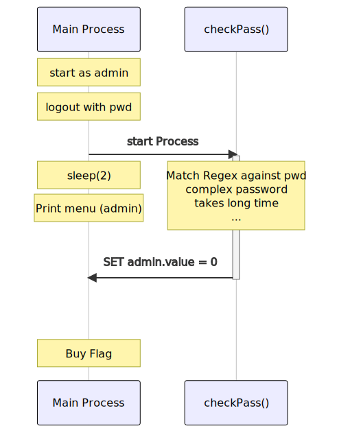

# Off To The Races

> They say that gambling leads to regrets, but we'll see. This online portal lets you bet on horse races, and if you can guess the admin password, you can collect all the money people lose, too. Maybe you'll collect enough to buy the flag?

We have the python sourcecode of a gambling server. I'll pick out the important stuff here:
```python
def menu():
    print("1) Place Bet")
    print("2) Login as Admin")
```
As a normal user, we can place a bet or log in. Users do not have limited amount of money, we can just bet anything on any horse.
```python
def admin_menu():
    print("1) Declare winner")
    print("2) View balance")
    print("3) Buy flag for $100")
    print("4) Logout")
```
As the admin, we can declare the winner of a race, show the balance (of the racing company), buy the flag and logout. Those are our options. 

```python
rx = re.compile(r'ju(5)tn((([E3e])(v\4))+\4\5)+rl0\1\4')
```
Valid passwords are all those, that match this regex. For me it helped to write it down in multiple lines with intendations for a better readability. Passwords start with `ju5tn` (and `5` is the first matching group later refered to by `\1`. Then we have a character of the set `E3e` (group 4) followed by `v` and the same character again, because `\4` references the previously matched character. This 3-character-sequence is repeated a number of times. Then followes one time the sequence again (`\4\5`) and this combined part is repeated again several times. The password ends with `r105` and one time our favorite character again. `ju5tnEvEEvErl05E` is an example and it can be extended by adding more `EvE`in the middle.

```python
def flag():
    if admin.value:
        print("Admins aren't allowed to view the flag!")
        return
    if balance >= 100:
        print(open("flag.txt").read())
        exit(0)
    else:
        print("Insufficient balance!")
```
We get the flag if we are __not__ the admin, and we collected at least 100 money. The problem is, we can only call this as the admin user.
```python
def declareWinner():
    # [...shortened for clarity...]
    winner = choice(list(bets))
    print("%s is the big winner!"%winner)
    for i in bets:
        balance -= bets[i]*(-1+2*(winner==i))
    bets = {}
```
A winner is choosen randomly from the list of bets. The balance computation can be guessed what it does, but to be sure, let's dissect it:
`winner==i`is True (=1) for the winning horse, and False (=0) otherwise. So we get `balance -= bets[i]*1` for the winning horse (we (= the company) looses the money, otherwise `balance -= bets[i]*-1` equals `balance += bets[i]`, we win the money for losing horses.
### Winning Money
We designate one horse to loose and bet a lot of money on it. Additionally, we bet $0 on several other horses. The more horses we use, the higher are the chances for our designated horse to loose. (I used 10 horses giving me a chance of only 1/11 for my designated *LoosingHorse* to win, in which case I would simply restart the script.
(I realized from other Writeups after the contest: The better way to do this, would be betting the same amount `X` on 3 different horses. In this case, two of them loose, and one wins, so the total balance is `-2X + X = X`. No probability involved).
So, the easier part of the challenge is getting the money: Place bets, login as admin, declare a winner.
### Logging in
```python
def login():
    pwd = input("Enter admin password (empty to logout): ")
    if len(pwd) == 0:
        print("Logging out...")
        admin = 0
        return
    print("Validating...")
    Process(None, checkPass, None, args=(pwd,)).start()
    time.sleep(2)

def checkPass(pwd):
    valid = rx.match(pwd)
    if valid:
        print("Login success!")
        print("Redirecting...")
        admin.value = 1
    else:
        print("Login failure!")
        print("Redirecting...")
        admin.value = 0
```
This is the login part. `checkPass` matches the password with the regex and sets `admin.value` accordingly.
The magic happens in `login`: With `Process`, a new subprocess is spawed that checks the password, while the main process sleeps for 2 seconds before returning (and prints the menu again). A new thread in a challenge about *races* .. is it far to think about *Race Conditions*? 
### The Race
We can only call `flag()` while inside the `admin_menu()`, but inside `flag()`, we need `admin.value = 0`  to get the flag. So we need to somehow change our admin state between starting `admin_menu()` and the check for `admin.value = 0`. We do this by slowing down the `checkPass()` function. This can be achieved by a long password that is eventually invalid. Regex are slow, especially if we have to match complex strings. The number of `EvE` inside the password needs to be adapted to th speed of the checking hardware. I used 30 times.

### Winning the Race
Let's look at the flow of both process during a normal logout and a slow one:


In both cases, we start logged in as the admin user and start a logout. The main process will wait 2 seconds for the `checkPass()` to complete, which sets `admin.value` back to 0 if we use an invalid password (Note that Logout calls `login()`). After the two seconds sleep, we get the user menu and cannot do anything useful.
In the second case, we provide an invalid but long password. In this case, the sleep terminates faster than the `checkPass` function. As a result, the main process sees us as the admin and calls the `admin_menu`. And we wait .. and wait .. and wait .. *until* `checkPass` failed to validate our password and sets `admin.value = 0`. *Now*, we can call *Buy flag* (because the admin menu is still present) and we will get the flag because `admin.value` is false.
### Putting everything together
1. Place some bets
2. Login with ju5tnEvEEvErl05E
3. Declare a winner
4. Logout with ju5tnEvEEvEEvEEvEEvEEvEEvEEvEEvEEvEEvEEvEEvEEvEEvEEvEEvEEvEEvEEvEEvEEvEEvEEvEEvEEvEEvEEvEEvEEvErl05X
5. We get the admin menu, but wait until the failure message is received
6. Buy the flag


